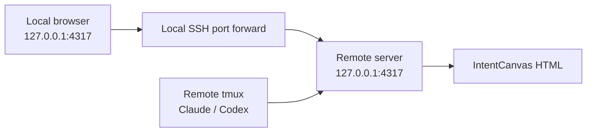
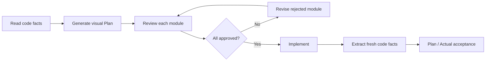

# IntentCanvas

[](https://github.com/MisterRaindrop/intentcanvas/releases/latest)
[](LICENSE)
[](package.json)

**Turn an AI coding plan into something you can review visually before the agent writes code.**

IntentCanvas gives Claude Code and Codex a visual-first planning workflow:

```text
Analyze code → Generate a visual plan → Human review → Approved implementation → Plan / Actual acceptance
```

[简体中文](README.zh-CN.md) · [Install](#install-intentcanvas) · [Remote tmux](#remote-tmux-open-the-server-page-locally) · [Usage](#usage) · [Roadmap](docs/roadmap.md)

## Background

Complex features often cross several modules. A prose-only plan makes it hard to answer:

- Which modules are going to change?
- Where will new classes, interfaces, and dependencies live?
- How will the critical call paths change?
- Is the proposal adding unnecessary abstractions?
- Did the final implementation drift from the approved design?

IntentCanvas turns the plan into an interactive HTML review with a system overview, simplified per-module UML, focused call paths, member diffs, and pseudocode.

```text
analysis tools extract code facts
AI proposes the design
the user approves the scope
the implementation is checked against the approved plan
```

## What you see

| View | Contents |
| --- | --- |
| System overview | Affected modules, their relationships, and one plain-language summary per module |
| Module detail | Simplified UML, top-level entry points, critical call paths, member changes, and pseudocode |
| Approval | Review modules individually, request changes, or approve every pending module at once |
| Acceptance | Differences between the Approved Plan and the implemented code |

Change status uses a consistent color language:

```text
green: added
red: removed
yellow: modified
gray: unchanged
```

Large changes are not forced into one enormous UML diagram. Start with the system overview, then review one bounded module at a time.

## Requirements

- macOS or Linux
- Git
- Node.js 22.13 or newer
- pnpm or Corepack
- Claude Code or Codex
- tmux, optional and recommended for remote development

Check Node.js:

```bash
node --version
```

If it is older than `22.13`, upgrade first:

```bash
nvm install 22
nvm use 22
corepack enable
```

See the [Node.js 22 downloads](https://nodejs.org/en/download/archive/v22).

### Install Claude Code or Codex

IntentCanvas works with either agent.

Claude Code:

```bash
curl -fsSL https://claude.ai/install.sh | bash
```

Codex CLI:

```bash
npm install -g @openai/codex
```

See the [Claude Code installation guide](https://code.claude.com/docs/en/quickstart) and [Codex CLI documentation](https://learn.chatgpt.com/docs/codex/cli).

## Install IntentCanvas

Run these three commands:

```bash
git clone https://github.com/MisterRaindrop/intentcanvas.git
cd intentcanvas
./intentcanvas setup
```

`setup` is the only installation entry point. It automatically:

- installs workspace dependencies;
- starts the IntentCanvas Runtime;
- installs the Claude Code plugin and approval Hook;
- installs the Codex `visual-plan` Skill;
- creates local credentials and the command-line entry point.

You do not need to install another plugin from inside Claude Code or Codex.

Check the installation:

```bash
./intentcanvas doctor
```

> Run Setup as the same operating-system user that runs Claude Code or Codex.
>
> If the agent runs on a remote server, install IntentCanvas on that server.

## Claude Code and Codex

### Claude Code

Restart Claude Code after the first setup, or run:

```text
/reload-plugins
```

Create a visual plan with:

```text
/intentcanvas:visual-plan
```

### Codex

Restart Codex after the first setup.

Create a visual plan with:

```text
$visual-plan
```

## Local tmux

When Claude Code or Codex, tmux, IntentCanvas, and the browser all run on the same machine, tmux needs no special configuration:

```bash
cd /path/to/project
tmux new-session -A -s project
claude
```

For Codex, replace the last line with:

```bash
codex
```

When the plan is ready, the terminal prints:

```text
Open visual plan
```

Open the link in your local browser.

The link is one-use and remains valid for five minutes. Once opened, the browser review session can remain active.

## Remote tmux: open the server page locally

Assume that:

- Claude Code or Codex, tmux, and IntentCanvas run on a remote server;
- iTerm2 and your browser run on your local computer;
- IntentCanvas listens on the server at `127.0.0.1:4317`.



### 1. Connect from your local computer

Run this in a local terminal:

```bash
ssh -L 4317:127.0.0.1:4317 user@server
```

The same command logs in and creates the browser tunnel:

```text
local 127.0.0.1:4317
          ↓ SSH
server 127.0.0.1:4317
```

Your local computer does not need IntentCanvas. Keep this SSH connection open while reviewing the page.

### 2. Enter tmux on the server

```bash
cd /path/to/project
tmux new-session -A -s project
claude
```

IntentCanvas must already be installed on this remote server.

### 3. Open the page locally

When the plan is ready, remote tmux prints:

```text
Review URL: http://127.0.0.1:4317/?review=...
Open visual plan
```

In local iTerm2, hold `Command` and click `Open visual plan`.

The browser connects to local `127.0.0.1:4317`; SSH forwards that request to the remote IntentCanvas Runtime.

This means:

- no public server address is used for the page;
- port 4317 does not need to be exposed by the server firewall;
- `.tmux.conf` does not need to change;
- IntentCanvas does not need to be installed locally.

If your terminal does not open the link directly, copy the complete URL into your local browser.

The link is one-use and valid for five minutes. If it expires, ask the agent for a fresh link; the Plan is not lost.

### 4. Save the SSH configuration

Add this to `~/.ssh/config` on your local computer:

```sshconfig
Host dev-server
    HostName server.example.com
    User your-name
    LocalForward 4317 127.0.0.1:4317
    ExitOnForwardFailure yes
```

Future connections only need:

```bash
ssh dev-server
```

The browser tunnel is created automatically.

### After SSH disconnects

The tmux session remains alive, but the SSH browser tunnel closes.

Reconnect and restore tmux:

```bash
ssh dev-server
tmux attach -t project
```

If the original link expired, ask the agent for a fresh link. The plan itself does not need to be regenerated.

## Usage

### 1. Describe the change

In Claude Code, run:

```text
/intentcanvas:visual-plan
```

In Codex, run:

```text
$visual-plan
```

Then describe the work normally:

```text
Add transparent data encryption to this project.

First create a visual plan showing the module relationships, simplified UML for
each module, critical entry points, focused call paths, member changes, and pseudocode.

Do not modify code until I approve every module.
```

### 2. Review the visual plan

The agent prints a review link after analysis.

In the page:

1. Check the overall design and affected modules.
2. Open a module and review its simplified UML.
3. Inspect the entry points, call paths, and pseudocode.
4. Approve correct modules.
5. Leave a focused change request for anything that needs revision.

When one module is rejected, the agent regenerates only that module. Approvals for other modules remain valid.

If the overall design is correct, use **Approve all pending modules**. It approves only modules that are still pending and never overwrites a module marked **Changes requested**.

### 3. Implement after approval

After every module is approved, return to the terminal:

```text
All modules are approved. Implement the approved plan.
```

The Claude Code approval Hook blocks writes before approval. The Codex Skill waits for approval before entering the implementation phase.

### 4. Review the implementation

After implementation, IntentCanvas extracts fresh code facts and compares:

```text
Approved Plan
      VS
Implemented Code
```

The acceptance view reports:

- incomplete planned work;
- unapproved modules or dependencies;
- public-interface drift;
- critical call-path changes;
- evidence gaps that require human judgment.

If implementation requires a material change to the approved design, return to review instead of rewriting the approval record.

## Does leaving the page open use model tokens?

No. The HTML page, Runtime, module navigation, expanded call paths, comments, and approval actions are all local and do not call a model.

Model tokens are used only when Claude Code or Codex analyzes code, creates or revises the Plan, implements the change, or produces acceptance results. Leaving the review page open does not consume additional tokens.

## Workflow



## Current focus

IntentCanvas currently focuses on:

- large C/C++ projects;
- database and storage systems;
- distributed systems;
- cross-module features;
- architectural changes and structural refactors.

Future work includes richer code facts, complexity views, dependency matrices, and large-project graph navigation. See the [roadmap](docs/roadmap.md).

## License

IntentCanvas is licensed under the [Apache License 2.0](LICENSE).
