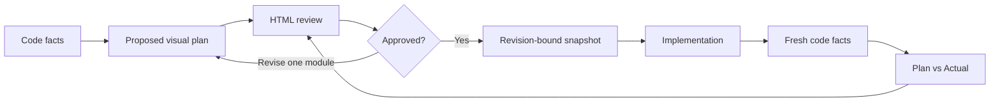

# IntentCanvas

[](https://github.com/MisterRaindrop/intentcanvas/releases/latest)
[](LICENSE)
[](package.json)

**Visual plans that humans can review before AI writes code.**

IntentCanvas turns an AI-generated coding plan into a visual contract: review the architecture, inspect one module at a time, approve the exact design, and compare the implementation with that approved plan.

> See the intent. Approve the change. Verify the result.

[简体中文](README.zh-CN.md) · [Quick start](#quick-start) · [Workflow](#the-review-workflow) · [Remote tmux](#tmux-ssh-and-clickable-links) · [Roadmap](docs/roadmap.md)

IntentCanvas is designed for changes that are difficult to judge from prose alone: large C/C++ systems, database kernels, distributed systems, cross-module features, and structural refactors.

## Why IntentCanvas

An ordinary AI plan asks you to read several pages of text and reconstruct the design in your head. For a feature such as transparent data encryption in a database, that makes it hard to answer basic review questions:

- Which modules will change?
- Where does the new abstraction enter the call path?
- Which classes, methods, and dependencies are added or removed?
- Did the implementation introduce unapproved work?

IntentCanvas presents the same change at three review levels:

| Review level | What you see | What you decide |
| --- | --- | --- |
| System overview | Changed modules, relationships, and one plain-language sentence per module | Is the overall scope and architecture reasonable? |
| One module | Simplified UML, entry points, focused call paths, member changes, pseudocode, risks, and checks | Is this module going to change in the right place and in the right way? |
| Acceptance | Plan-versus-Actual status, missing work, unapproved drift, and evidence gaps | Did the implementation stay inside the approved design? |

Large features remain readable because the overview never tries to render the entire repository. Enter one module, review a bounded amount of information, then use **Previous module**, **Next module**, or **Back to overview**.

A focused path can look like this:

```text
DeltaWriterV2::init()
    └── … 3 unchanged calls (click to expand)
        └── RowsetWriterContext::fs()                 modified
            └── EncryptedOutputStream                 added
```

If one module needs adjustment, only that complete module is regenerated. Approvals for untouched modules remain valid.

## How it works



The core rule is simple:

```text
code facts come from analysis tools
design decisions come from the model
implementation starts only after approval
actual implementation is checked against the approved contract
```

## Quick start

### 1. Install

Requirements:

- Node.js 22 or newer
- Corepack or pnpm
- Claude Code and/or Codex if you want the agent integration
- `clang-uml` is optional but recommended for C/C++ structural evidence

```bash
git clone https://github.com/MisterRaindrop/intentcanvas.git
cd intentcanvas
./intentcanvas setup
./intentcanvas doctor
```

Setup is idempotent. It installs workspace dependencies, creates private local credentials, starts the loopback Runtime, links the Codex Skill, registers the Claude marketplace when Claude Code is available, and creates `~/.local/bin/intentcanvas` without replacing an unrelated command or Skill.

The examples below use `intentcanvas`. If `~/.local/bin` is not on your `PATH`, use `./intentcanvas` from the checkout instead.

### 2. Ask for a visual plan

In Claude Code:

```text
/intentcanvas:visual-plan
```

In Codex:

```text
$visual-plan
```

Then describe the change normally, for example:

```text
Add transparent data encryption to the storage layer. Show me the visual plan before editing code.
```

### 3. Click the review link

The terminal prints an OSC8 hyperlink. In iTerm2 and other compatible terminals, click it to open the local HTML review. Review the overall graph, enter each module, request targeted changes or approve it, and return to the terminal when the plan is ready.

The browser handoff is random, works once, and expires after 60 seconds. Generate a fresh link at any time:

```bash
intentcanvas plan open <review-id>
```

## The review workflow

### Prepare trustworthy C/C++ facts

Preview every tool invocation before allowing project build logic to run:

```bash
intentcanvas facts prepare /path/to/project --dry-run
```

Then prepare the current evidence:

```bash
intentcanvas facts prepare /path/to/project \
  --output /tmp/current-facts.json
```

IntentCanvas reuses an existing `compile_commands.json`. If one is missing, v0.3 can configure a CMake project in a private directory under `~/.intentcanvas/evidence`. When available, clang-uml supplies class and include structure. Commands use fixed argument arrays rather than a shell, and the exact invocations are recorded in `manifest.json`.

### Validate and import the plan

The agent normally performs these steps through the Skill. They are also available directly:

```bash
intentcanvas plan validate ./plan.json
intentcanvas plan import ./plan.json
```

The imported Plan Model is strict and versioned. Runtime owns approval state; text in the chat cannot silently mark a module as approved.

### Revise only what changed

For feedback confined to one module:

```bash
intentcanvas plan revise <review-id> <module-id> ./module.json
```

That module returns to `pending`. Untouched modules keep their approvals. Changes to system relationships, global risks, or project-wide verification still require a full-plan revision.

### Freeze the approved design

v0.3 requires all modules to be approved before implementation:

```bash
intentcanvas plan gate <review-id>
intentcanvas plan freeze <review-id> ./approved-snapshot.json
```

The snapshot is bound to one Runtime revision and one deterministic plan digest. If the plan changes, the prior acceptance result is invalidated.

### Verify Plan versus Actual

The strongest path compares Code Facts from before and after implementation:

```bash
intentcanvas acceptance facts <review-id> \
  ./current-facts.json ./implemented-facts.json
```

A Plan-shaped Implemented Model can also be published when a visual structural comparison is useful:

```bash
intentcanvas plan validate ./implemented.json
intentcanvas acceptance model <review-id> ./implemented.json
```

The command prints a fresh link ending in `#acceptance`. The HTML report shows an overall result and one card per module. Exit code `0` means the structural contract matches; exit code `4` means the result is incomplete or requires human review.

## tmux, SSH, and clickable links

If tmux, Runtime, and the terminal run on the same machine, click the printed link directly.

When Claude or Codex runs inside tmux on a remote SSH server, start the Bridge on the **local laptop** and keep it open:

```bash
# Local laptop
intentcanvas bridge ssh user@build-host \
  --review <review-id> \
  --remote-port 4317
```

Then generate a fresh link inside the remote session:

```bash
# Remote server / tmux
intentcanvas plan open <review-id>
```

Clicking the remote terminal link opens `127.0.0.1:4317` on the laptop, and the loopback-only Bridge forwards it to the remote Runtime. The Bridge validates its inputs, invokes `ssh` without a shell, and refuses to run its SSH mode from inside the remote session.

Inspect the current terminal environment with:

```bash
intentcanvas bridge environment
```

## What v0.3 includes

- System overview graph and one-line module summaries
- Simplified per-module UML and focused call paths
- Class, function, method, field, dependency, and pseudocode changes
- Previous/next module navigation and targeted module revision
- Module approval, revision history, execution gate, and Approved Snapshots
- C/C++ source, compilation, symbol, include, and call facts
- Plan-versus-Actual model diff and before/after Code Facts audit
- HTML acceptance results with per-module drill-down
- Claude Code Hook enforcement and shared Claude/Codex Skill
- Loopback Runtime, one-use browser sessions, OSC8 links, and SSH/tmux Bridge
- One-command setup, background start/stop, and environment diagnosis

## Current limits

| Area | v0.3 behavior |
| --- | --- |
| Missing compilation database | Automatic generation currently supports CMake only |
| Function bodies | clang-uml declarations alone are medium assurance; AST-backed body evidence is planned |
| Build and test evidence | Commands can be planned, but automatic bounded capture is not yet integrated into acceptance |
| Large graph exploration | Progressive Cytoscape.js expansion, dependency matrices, and clustering are planned |
| Partial execution | The whole plan must be approved; safe partial-module file ownership is not inferred yet |
| Remote desktop automation | The SSH Bridge is explicit; Moshi-style local supervision and notifications are future work |
| Approval isolation | The local token prevents accidental cross-action, not a malicious same-user agent |

See the [roadmap](docs/roadmap.md) for the planned AST evidence, quality capture, richer graphs, complexity views, and desktop host.

## Frequently asked questions

### Does the AI invent the UML?

It must not. Static tools provide files, symbols, signatures, includes, calls, and provenance. The model is responsible for design judgment, module boundaries, risks, pseudocode, and the proposed future shape. Missing evidence stays visible and cannot produce a false pass.

### Can it handle a large feature?

Yes, by progressive disclosure rather than one enormous UML diagram. Start with the module graph, review one bounded module, expand only the relevant call path, and return to the overview.

### Must the whole plan be regenerated after one comment?

No. A module-scoped comment replaces only that complete module. Other modules and their approvals are preserved.

### Does the web page replace the terminal workflow?

No. Claude or Codex remains in tmux. The terminal prints a clickable review link; the browser is only the review surface, and you return to the same terminal after approval.

### Is approval mechanically enforced?

Claude Code uses a synchronous fail-closed PreToolUse Hook for workspaces bound to a review. Codex follows the same gate procedurally through the Skill. Both still use Runtime as the approval source of truth.

## Repository layout

```text
apps/cli          terminal workflow and clickable review links
apps/runtime      local review state, approval gate, persistence, and APIs
apps/studio       dependency-free HTML review interface
packages/protocol versioned Plan, Code Facts, event, and snapshot contracts
packages/code-facts C/C++ evidence extraction and preparation
packages/plan-diff Plan-versus-Actual comparison
packages/bridge   loopback SSH/tmux forwarding
skills/visual-plan shared Claude Code and Codex workflow
```

Runtime and Studio live in one repository for v0.3, but their boundaries allow them to be split later. See [architecture](docs/architecture.md), [Claude Code integration](integrations/claude-code/README.md), and [Codex integration](integrations/codex/README.md).

## Development

```bash
pnpm install --frozen-lockfile
pnpm check
```

The current release passes 191 automated tests, architecture boundary checks, strict Claude marketplace validation, and Codex plugin validation.

## Security

- Runtime binds only to `127.0.0.1` and validates loopback Host and Origin values.
- CLI and Hooks verify a fresh challenge/HMAC identity proof before sending the private bearer token.
- Browser URLs contain a short-lived one-use handoff, never the long-term token.
- Browser sessions are review-scoped and cannot import plans, rewrite reviews, emit agent events, or mint new handoffs.
- Persistent state uses atomic writes, a single-owner data-directory lock, bounded history, and fail-closed corrupt-state handling.
- Bridge binds both ends to loopback and never constructs a shell command.

IntentCanvas does not yet provide cryptographic isolation from an agent running as the same OS user. A future desktop host or user-presence signature is required for an independently trusted human-approval boundary.

## License

Licensed under the [Apache License, Version 2.0](LICENSE).
