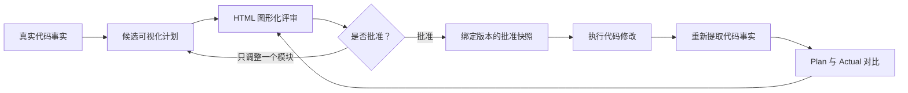

# IntentCanvas

[](https://github.com/MisterRaindrop/intentcanvas/releases/latest)
[](LICENSE)
[](package.json)

**先把 AI 的开发计划变成你能看懂、能批准的图，再允许它修改代码。**

IntentCanvas 将 AI 生成的代码计划变成一份可视化设计契约：先看总体架构，再逐个审核模块，批准准确的修改方案，最后把真实实现与批准版本进行比较。

> 先看图，再批准开发；实现完成后，用事实验收结果。

[English](README.md) · [快速开始](#快速开始) · [完整审查流程](#完整审查流程) · [远程-tmux](#tmuxssh-与终端点击) · [路线图](docs/roadmap.md)

IntentCanvas 面向那些很难只靠文字判断的修改：大型 C/C++ 项目、数据库内核、分布式系统、跨模块功能和结构性重构。

## 为什么需要 IntentCanvas

普通 AI Plan 往往要求你阅读几千字，然后在脑中重新还原代码结构。以数据库透明加密为例，仅靠文字很难快速回答：

- 到底会修改哪些模块？
- 新抽象从调用链的哪个位置进入？
- 哪些类、函数和依赖会新增、删除或修改？
- 最终实现是否偷偷增加了计划外内容？

IntentCanvas 将同一次开发拆成三个审查层级：

| 审查层级 | 你会看到什么 | 你需要判断什么 |
| --- | --- | --- |
| 总体设计 | 本次涉及的模块、模块关系，以及每个模块一句通俗说明 | 整体范围和架构是否合理？ |
| 单个模块 | 简化 UML、顶层入口、关键调用路径、成员变化、伪代码、风险和验证方式 | 是否在正确的位置，用正确的方式修改？ |
| 最终验收 | Plan 与 Actual 对比、未完成内容、计划外修改和证据缺口 | 实现是否遵守了批准方案？ |

复杂功能也不会被塞进一张巨大的 UML 图。你从总体设计进入一个模块，每次只审查有限内容，然后使用 **上一个模块**、**下一个模块** 或 **返回总体设计** 继续查看。

一个聚焦后的调用路径可能是：

```text
DeltaWriterV2::init()
    └── … 省略 3 个未修改函数（点击展开）
        └── RowsetWriterContext::fs()                 修改
            └── EncryptedOutputStream                 新增
```

如果某个模块需要调整，只重新生成这个完整模块；其他模块和已经做出的批准不会丢失。

## 工作原理



整个流程遵守四条原则：

```text
代码事实由分析工具提取
设计判断由模型完成
批准之前不允许开始实现
实现完成后必须与批准方案比较
```

## 快速开始

### 1. 安装

需要：

- Node.js 22 或更高版本
- Corepack 或 pnpm
- 如果需要 Agent 集成，安装 Claude Code 和/或 Codex
- C/C++ 项目建议安装 `clang-uml`，但不是启动 IntentCanvas 的硬性要求

```bash
git clone https://github.com/MisterRaindrop/intentcanvas.git
cd intentcanvas
./intentcanvas setup
./intentcanvas doctor
```

Setup 可以重复执行。它会安装工作区依赖、创建本地私有凭证、启动只监听本机的 Runtime、链接 Codex Skill，并在发现 Claude Code 时注册本地 Marketplace。它会创建 `~/.local/bin/intentcanvas`，但不会覆盖同名且不属于 IntentCanvas 的命令或 Skill。

下文统一使用 `intentcanvas`。如果 `~/.local/bin` 不在你的 `PATH` 中，请在仓库内改用 `./intentcanvas`。

### 2. 让 Agent 生成可视化计划

在 Claude Code 中：

```text
/intentcanvas:visual-plan
```

在 Codex 中：

```text
$visual-plan
```

然后像平时一样描述开发需求：

```text
给存储层增加透明数据加密。先生成可视化计划，等我批准后再修改代码。
```

### 3. 点击终端里的评审链接

终端会输出 OSC8 超链接。在 iTerm2 等兼容终端中直接点击，即可打开本地 HTML 页面。

先查看总体模块图，再逐个进入模块。对于不合理的部分直接填写调整意见；全部模块确认后回到原来的终端继续开发。

浏览器链接使用随机的一次性凭证，60 秒后过期，而且只能使用一次。需要重新打开时执行：

```bash
intentcanvas plan open <review-id>
```

## 完整审查流程

### 准备可信的 C/C++ 代码事实

在运行项目构建逻辑之前，先预览将执行的固定命令：

```bash
intentcanvas facts prepare /path/to/project --dry-run
```

确认后生成当前代码事实：

```bash
intentcanvas facts prepare /path/to/project \
  --output /tmp/current-facts.json
```

IntentCanvas 会优先复用现有的 `compile_commands.json`。如果文件不存在，v0.3 可以在 `~/.intentcanvas/evidence` 私有目录中配置 CMake 项目。安装 clang-uml 后，还会提取类和 Include 结构。

工具始终通过固定参数数组启动，不拼接 Shell 命令；实际执行的命令、输出摘要和结果会记录到 `manifest.json`。

### 校验并导入计划

正常情况下由 Skill 自动完成，也可以手动执行：

```bash
intentcanvas plan validate ./plan.json
intentcanvas plan import ./plan.json
```

Plan Model 是严格、带版本的结构化契约。审批状态由 Runtime 管理，聊天中的一句“可以”不会被偷偷当成正式批准。

### 只调整有问题的模块

如果意见只涉及一个模块：

```bash
intentcanvas plan revise <review-id> <module-id> ./module.json
```

只有这个模块会回到 `pending`，其他模块的批准继续有效。涉及顶层依赖关系、全局风险或系统级验证方式的修改，仍然需要更新整个 Plan。

### 冻结批准方案

v0.3 要求所有模块都通过批准才能开始实现：

```bash
intentcanvas plan gate <review-id>
intentcanvas plan freeze <review-id> ./approved-snapshot.json
```

批准快照绑定到明确的 Runtime 版本和确定性摘要。只要计划再次变化，旧的验收结果就会自动失效。

### 验收 Plan 与 Actual

最可靠的方式是比较开发前后的真实 Code Facts：

```bash
intentcanvas acceptance facts <review-id> \
  ./current-facts.json ./implemented-facts.json
```

如果还希望得到与 Plan 相同结构的可视化 Actual，也可以发布 Implemented Model：

```bash
intentcanvas plan validate ./implemented.json
intentcanvas acceptance model <review-id> ./implemented.json
```

命令会打印一个以 `#acceptance` 结尾的新链接。HTML 页面显示总体结论和每个模块的验收卡片。退出码 `0` 表示结构契约匹配；退出码 `4` 表示内容未完成、发生计划外变化或仍需人工判断。

## tmux、SSH 与终端点击

如果 tmux、Runtime 和终端都在同一台机器上，直接点击终端输出的链接即可。

如果 Claude/Codex 和 tmux 在远程 SSH 服务器上，需要在**本地电脑**启动 Bridge 并保持运行：

```bash
# 本地电脑
intentcanvas bridge ssh user@build-host \
  --review <review-id> \
  --remote-port 4317
```

然后在远程 tmux 中生成一个新链接：

```bash
# 远程服务器 / tmux
intentcanvas plan open <review-id>
```

点击远程终端里的链接时，iTerm 会打开本机 `127.0.0.1:4317`，Bridge 再将请求转发到远程 Runtime。Bridge 会校验参数，通过参数数组调用 `ssh`，并确保两端都只监听 Loopback。

查看当前终端、tmux 和 SSH 环境：

```bash
intentcanvas bridge environment
```

## v0.3 已经具备的能力

- 总体模块图，以及每个模块一行通俗说明
- 单模块简化 UML 和聚焦后的关键调用路径
- 类、函数、方法、字段、依赖和伪代码变化
- 上一个/下一个模块导航，以及单模块重新规划
- 模块审批、版本历史、执行门禁和 Approved Snapshot
- C/C++ 文件、编译、符号、Include 和调用关系事实
- Approved Plan 与 Implemented Model 对比
- 开发前后 Code Facts 直接审计
- HTML 验收结果和逐模块查看
- Claude Code Hook 约束，以及 Claude/Codex 共享 Skill
- Loopback Runtime、一次性浏览器会话、终端链接和 SSH Bridge
- 一键 Setup、后台启停和环境诊断

## 当前边界

| 方向 | v0.3 当前能力 |
| --- | --- |
| 缺少 Compilation Database | 自动生成目前只支持 CMake |
| 函数体证据 | 只有 clang-uml 声明时属于中等可信度，后续将增加 AST 函数体证据 |
| 编译与测试证据 | 可以在 Plan 中列出命令，但还没有自动收集并放入最终验收 |
| 大型项目图形 | Cytoscape.js 逐层展开、依赖矩阵和聚类尚未完成 |
| 部分模块执行 | 当前必须批准整个 Plan，还不能自动推断安全的文件级局部执行范围 |
| 远程桌面自动化 | 当前使用显式 SSH Bridge，Moshi 风格的本地守护和通知尚未完成 |
| 审批隔离 | 本地令牌用于防止误操作，不能防御与用户使用同一系统账号的恶意 Agent |

后续 AST 证据、自动质量检查、更丰富的大型项目图、复杂度视图和桌面 Host 见[路线图](docs/roadmap.md)。

## 常见问题

### UML 是 AI 猜出来的吗？

不应该是。静态分析工具负责提供文件、符号、函数签名、Include、调用关系和来源；模型负责模块边界、设计判断、风险、伪代码和候选未来结构。证据不足会明确显示，不能被当成通过。

### 大型功能真的显示得过来吗？

依靠逐层展开，而不是生成一张包含几百个节点的 UML。先审查总体模块，再进入一个有限大小的模块，只展开与本次修改相关的调用路径。

### 一个模块需要调整，必须全部重新生成吗？

不需要。模块级意见只替换这个完整模块，其他模块和已有批准都会保留。

### 网页会不会让我脱离 tmux 开发环境？

不会。Claude 或 Codex 继续留在 tmux 中，网页只是审查界面。批准后回到原来的终端继续工作。

### 批准是否真的能够限制 AI？

Claude Code 对已经绑定 Review 的工作区使用同步、失败即阻断的 PreToolUse Hook。Codex 通过 Skill 按同样的门禁流程执行，但当前属于流程约束。两者都以 Runtime 状态作为唯一审批事实来源。

## 仓库结构

```text
apps/cli          终端工作流和可点击评审链接
apps/runtime      本地评审状态、审批门禁、持久化和 API
apps/studio       零依赖 HTML 图形化评审界面
packages/protocol Plan、Code Facts、事件和快照协议
packages/code-facts C/C++ 代码事实提取与准备
packages/plan-diff Plan 与 Actual 对比
packages/bridge   Loopback SSH/tmux 转发
skills/visual-plan Claude Code 与 Codex 共享工作流
```

v0.3 将 Runtime 与 Studio 放在同一个仓库中，但模块边界允许后续独立拆分。更多信息见[架构说明](docs/architecture.md)、[Claude Code 集成](integrations/claude-code/README.md)和 [Codex 集成](integrations/codex/README.md)。

## 开发与验证

```bash
pnpm install --frozen-lockfile
pnpm check
```

当前版本通过了 191 项自动化测试、架构边界检查、Claude Marketplace 严格校验和 Codex 插件校验。

## 安全设计

- Runtime 只监听 `127.0.0.1`，并校验 Loopback Host 和 Origin。
- CLI 和 Hook 发送私有令牌前，必须通过新的 Challenge/HMAC 证明 Runtime 身份。
- 浏览器 URL 只包含短时、一次性 Handoff，不包含长期令牌。
- 浏览器会话只绑定一个 Review，不能导入或重写计划、发送 Agent 事件或生成新链接。
- 持久化使用原子写入、单进程数据目录锁、有限版本历史，并对损坏状态失败关闭。
- Bridge 两端都绑定 Loopback，并且从不构造 Shell 命令。

IntentCanvas 当前不能在密码学意义上隔离一个与用户使用相同 OS 账号的 Agent。未来需要独立桌面 Host 或用户在场签名，才能形成独立可信的人类审批边界。

## 开源协议

使用 [Apache License, Version 2.0](LICENSE)。
