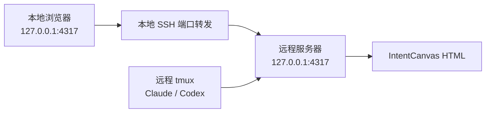
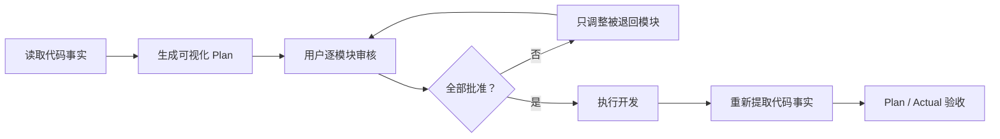

# IntentCanvas

[](https://github.com/MisterRaindrop/intentcanvas/releases/latest)
[](LICENSE)
[](package.json)

**先把 AI 的开发计划变成可以审核的图，再允许它修改代码。**

IntentCanvas 为 Claude Code 和 Codex 提供图形优先的代码规划流程：

```text
分析代码 → 生成可视化计划 → 人工审核 → 批准后开发 → Plan / Actual 验收
```

[English](README.md) · [安装](#安装-intentcanvas) · [远程 tmux](#远程-tmux在本地查看服务器页面) · [如何使用](#如何使用) · [路线图](docs/roadmap.md)

## 背景

复杂功能通常跨越多个模块。只阅读文字 Plan，很难快速判断：

- 准备修改哪些模块；
- 新增的类、接口和依赖放在哪里；
- 关键调用路径会如何变化；
- 是否增加了不必要的抽象；
- 最终实现是否偏离了批准方案。

IntentCanvas 将 Plan 转换为可交互的 HTML 页面，使用总体架构图、单模块简化 UML、关键调用路径、成员 Diff 和伪代码降低评审成本。

```text
代码事实由分析工具提取
设计方案由 AI 生成
修改范围由用户批准
最终实现与批准方案自动比较
```

## 你会看到什么

| 页面 | 内容 |
| --- | --- |
| 总体设计 | 涉及模块、模块关系、每个模块的一行修改说明 |
| 模块详情 | 简化 UML、顶层函数入口、关键调用路径、成员变化和伪代码 |
| 审批页面 | 逐个批准、退回模块，或一键批准全部待审核模块 |
| 验收页面 | Approved Plan 与实际代码的差异 |

变更状态使用统一颜色：

```text
绿色：新增
红色：删除
黄色：修改
灰色：保持不变
```

复杂功能不会被塞进一张巨大的 UML 图。用户先查看总体设计，再一次只审核一个模块。

## 环境要求

- macOS 或 Linux
- Git
- Node.js 22.13 或更高版本
- pnpm 或 Corepack
- Claude Code 或 Codex
- tmux，可选，推荐用于远程开发

检查 Node.js：

```bash
node --version
```

如果版本低于 `22.13`，请先升级：

```bash
nvm install 22
nvm use 22
corepack enable
```

参考：[Node.js 下载](https://nodejs.org/en/download/archive/v22)

### 安装 Claude Code 或 Codex

IntentCanvas 支持二者任选其一。

Claude Code：

```bash
curl -fsSL https://claude.ai/install.sh | bash
```

Codex CLI：

```bash
npm install -g @openai/codex
```

参考：[Claude Code 安装文档](https://code.claude.com/docs/en/quickstart) · [Codex CLI 文档](https://learn.chatgpt.com/docs/codex/cli)

## 安装 IntentCanvas

只需要执行：

```bash
git clone https://github.com/MisterRaindrop/intentcanvas.git
cd intentcanvas
./intentcanvas setup
```

`setup` 是唯一安装入口，会自动完成：

- 安装项目依赖；
- 启动 IntentCanvas Runtime；
- 安装 Claude Code 插件和审批 Hook；
- 安装 Codex `visual-plan` Skill；
- 创建本地凭证和命令行入口。

不需要再进入 Claude Code 或 Codex 手工安装插件。

检查安装状态：

```bash
./intentcanvas doctor
```

> 请使用运行 Claude Code 或 Codex 的同一个系统用户执行 Setup。
>
> 如果 Agent 运行在远程服务器，就在远程服务器安装 IntentCanvas。

## Claude Code 与 Codex

### Claude Code

首次安装后重新启动 Claude Code，或者执行：

```text
/reload-plugins
```

生成可视化计划：

```text
/intentcanvas:visual-plan
```

### Codex

首次安装后重新启动 Codex。

生成可视化计划：

```text
$visual-plan
```

## 本机 tmux

Claude Code、Codex、tmux 和浏览器都在同一台机器时，不需要配置 tmux：

```bash
cd /path/to/project
tmux new-session -A -s project
claude
```

使用 Codex 时将最后一行替换为：

```bash
codex
```

Agent 生成计划后，终端会显示：

```text
Open visual plan
```

点击链接即可在本机浏览器中打开页面。

链接只能使用一次，有效期为 5 分钟；页面打开后，浏览器评审会话可以持续使用。

## 远程 tmux：在本地查看服务器页面

假设：

- Claude Code、Codex、tmux 和 IntentCanvas 在远程服务器；
- iTerm2 和浏览器在本地电脑；
- IntentCanvas 页面运行在服务器的 `127.0.0.1:4317`。



### 1. 在本地电脑连接服务器

在本地终端执行：

```bash
ssh -L 4317:127.0.0.1:4317 user@server
```

这条命令同时完成登录和网页转发：

```text
本地 127.0.0.1:4317
          ↓ SSH
服务器 127.0.0.1:4317
```

本地电脑不需要安装 IntentCanvas，只需要保持 SSH 连接存在。

### 2. 在远程服务器进入 tmux

```bash
cd /path/to/project
tmux new-session -A -s project
claude
```

IntentCanvas 应当提前安装在这台远程服务器上。

### 3. 在本地打开页面

Agent 生成计划后，远程 tmux 会显示：

```text
Review URL: http://127.0.0.1:4317/?review=...
Open visual plan
```

在本地 iTerm2 中按住 `Command` 点击 `Open visual plan`。

浏览器访问的是本地 `127.0.0.1:4317`，SSH 会自动将请求转发到服务器上的 IntentCanvas。

因此：

- 不需要使用服务器公网 IP；
- 不需要开放服务器的 4317 端口；
- 不需要修改 `.tmux.conf`；
- 不需要在本地安装 IntentCanvas。

如果终端不能直接打开链接，复制完整 URL 到本地浏览器即可。

链接只能使用一次，有效期为 5 分钟。过期后让 Agent 生成新链接即可，Plan 不会丢失。

### 4. 保存 SSH 配置

可以在本地 `~/.ssh/config` 中加入：

```sshconfig
Host dev-server
    HostName server.example.com
    User your-name
    LocalForward 4317 127.0.0.1:4317
    ExitOnForwardFailure yes
```

以后只需要：

```bash
ssh dev-server
```

SSH 转发会自动建立。

### SSH 断开后

tmux 会话仍然保留，但 SSH 网页转发会停止。

重新连接并恢复 tmux：

```bash
ssh dev-server
tmux attach -t project
```

如果原来的链接已经过期，让 Agent 重新生成链接即可，不需要重新生成整个 Plan。

## 如何使用

### 1. 描述开发需求

在 Claude Code 中运行：

```text
/intentcanvas:visual-plan
```

在 Codex 中运行：

```text
$visual-plan
```

然后正常描述需求：

```text
为当前项目增加透明数据加密功能。

先生成可视化计划，展示总体模块关系、每个模块的简化 UML、
关键函数入口、主要调用路径、成员变化和伪代码。

在我批准全部模块之前不要修改代码。
```

### 2. 审核可视化计划

Agent 分析完成后会输出评审链接。

打开页面后：

1. 查看总体设计和模块修改范围；
2. 点击模块查看简化 UML；
3. 检查函数入口、调用路径和伪代码；
4. 批准正确的模块；
5. 为有问题的模块填写修改意见。

如果只退回一个模块，Agent 只重新生成这个模块，其他模块的批准状态会保留。

确认总体设计没有问题时，也可以点击“一键批准全部待审核模块”。按钮只批准仍为“待审核”的模块，不会覆盖已经标记为“需要调整”的模块。

### 3. 批准后开始开发

全部模块批准后，返回终端：

```text
全部模块已经批准，请按照批准方案开始实现。
```

Claude Code 的审批 Hook 会在批准前阻止写入。Codex Skill 会在工作流中等待批准后再进入实现阶段。

### 4. 验收实际实现

开发完成后，IntentCanvas 重新提取代码事实并比较：

```text
Approved Plan
      VS
Implemented Code
```

验收页面会显示：

- 计划内容是否完成；
- 是否出现计划外模块或依赖；
- 公共接口是否发生偏移；
- 关键调用路径是否符合方案；
- 哪些内容缺少证据，需要人工判断。

如果实际开发需要改变已批准的核心设计，应重新进入评审，而不是直接修改批准记录。

## 页面会消耗 Token 吗？

不会。HTML 页面、Runtime、模块切换、展开调用路径、填写意见和审批都是本地操作，不会调用模型。

只有 Claude Code 或 Codex 分析代码、生成或修改 Plan、执行开发和生成验收结果时才会消耗模型 Token。页面长时间保持打开不会额外消耗 Token。

## 工作流程



## 当前方向

IntentCanvas 当前重点支持：

- 大型 C/C++ 项目；
- 数据库和存储系统；
- 分布式系统；
- 跨模块功能；
- 架构调整和结构性重构。

后续将继续增加更丰富的代码事实、复杂度视图、依赖矩阵和大型项目图形导航能力，详见[路线图](docs/roadmap.md)。

## License

IntentCanvas 使用 [Apache License 2.0](LICENSE)。
